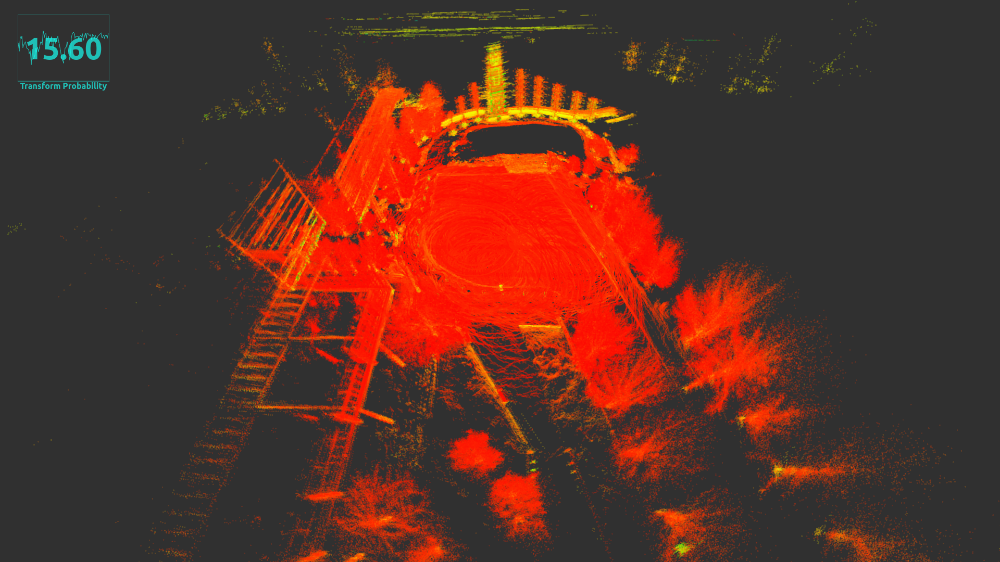

# 3D LIDAR SLAM | ROS

ROS Packages for Real-Time 3D LIDAR Based Simultaneous Localization and Mapping (SLAM) using Normal Distribution Transform (NDT) Scan Matching Algorithm.



3D maps enable autonomous vehicles to localize themselves in the environment. To localize using a map and LIDAR data one needs to find a way to associate the point cloud from the sensor with the point cloud from the map. This is also known as scan matching in robotics. One of the common ways to do this is the Iterative Closest Point (ICP) approach, which uses 6 degrees of freedom to find the closest point to the geometric entity from a given 3D point cloud. There exist a lot of geometric variants of ICP such as point-to-plane etc. One of the downfalls of ICP is that it needs a good approximation and a good starting point as it works on non-linear optimization and has the tendency to get stuck in local minima. In real-world scenarios, our points will probably be a little off from the map. Measurement errors will cause points to be slightly misaligned, plus the world might change a little between when we record the map and when we make our new scan. Normal Distribution Transform (NDT) scan matching provides a solution for these minor errors. Instead of trying to match points from our current scan to points on the map, we try to match points from our current scan to a grid of probability functions created from the map.

**NDT Mapping (Map Generation):** Transform the LIDAR point cloud into a piecewise continuous and differentiable probability density (NDT). The probability density contains a set of normal distributions where each point in the point cloud is assigned to a voxel. A voxel is a 3D lattice cube to which points are assigned depending on their coordinate value. The point cloud is divided into `k` `N-dimensional` voxel clouds and are then combined. A voxel grid filter is used to decrease the computation cost and reduce the noise from the 3D map.

**NDT Matching (Localization):** A search problem where we have to find a transform that maximizes NDT sum to match the different point clouds, a variety of minimization functions can be used for a dual of this problem. Newton nonlinear optimizer is used to find the best 6-DOF pose.

## Dependencies
***ndt_slam*** requires the following libraries:
- PCL
- OpenMP

***ndt_slam*** requires the following ROS packages:
- pcl_ros
- [ndt_omp](https://github.com/koide3/ndt_omp)
- tf2_sensor_msgs
- jsk_rviz_plugins

```bash
sudo apt install ros-$ROS_DISTRO-tf2-sensor-msgs
sudo apt install ros-$ROS_DISTRO-jsk-rviz-plugins
```

## Setup
```bash
cd ROS1_Workspace && catkin_make
```

## Execution
Open a terminal and launch `ndt_slam`.
```bash
roslaunch ndt_slam ndt_slam.launch
```
Open another terminal and play a pre-recorded `rosbag` or start streming data from sensor.
```bash
rosparam set use_sim_time true
rosbag play --clock <ROSBAG_PATH>
```
Open another terminal and call a service to save a PCD map of desired resolution to desired path.
```bash
rosservice call /ndt_slam_node/save_map 0.1 ~/map.pcd
```
